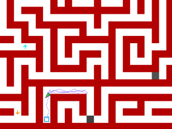
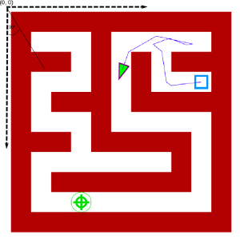

KrakRobot 2014
Lost in Cracow's alleys
===========================

Welcome to the rules and technical specification for the KrakRobot 2014 online qualifications task.

The qualifications round consists of one task,
called “Lost in Cracow's alleys”. Your task will be to write the robot's AI allowing
it to figure out the way through a complex maze of alleys as quick as possible.

In this package you will find the simulator, example maps in the 'maps' directory and example robots in the 'examples' directory.

General rules
-----------------------

1. Contestants have to be students, enrolled at Bachelor, Masters or PhD level programme in any field.
2. KrakRobot is a team competition – each team has to consist of 2 or 3 people, working together.
3. The task is simulation based – the appropriate code bundled
 with the example maps and robots is available here: https://github.com/uj-robotics/KrakRobot2014Qualifications
4. Each team writes their own implementation of the robot's AI (one per team), some sample implementations are also avaliable in
the package
5. The robot moves around a rectangular map of dimensions M x N (unknown to the robot)
6. The robot is executed by the simulator. The robot can choose from a given set of actions (for instance move or turn)
7. Each action performed (both sensing and acting) costs a set amount of time. The robot's total simulation time is the summed cost of all performed actions
 from the simulation start to the moment of reaching the goal state
 (which is checked for automatically by the simulation engine,
 and is defined as being located over the field and communicating it).
 The goal is to minimize total simulation time of finding the goal.===========================<<<goal - goal?>>>
8. Each map can have an upper bound on simulation time, after which all robots will be considered as having infinite total simulation time.
9. One round of simulations consists of running all teams' AIs on one, randomly generated map (the same for each robot).
In each round the constants (for instance accuracy of the GPS sensor) can change.
After each round, the ranking, obtained by sorting the total times in descending order, is created.
10. The whole qualifications will consist of multiple rounds, and the final position of each robot will be its median position in all the rankings.
The best teams (number of advancing teams will be disclosed in January) will advance to the finals, which will take place on 12 April 2014 in Cracow (more information will be available on the website soon).
11. Each simulation has limited CPU time, which will be passed to the robot at the initialization step. There is also a 1024 MB RAM limit.
12. Any modifications to the simulation code, attempts to hack the engine in order to achieve a better score (either by reading the map or by any other type of cheating) will result in the disqualification.of noise applied to forward motion====================<<<disqualification of noise? :P >>>
13. The jury has an indisputable right to disqualify any team if violations of these regulations are detected.
14. The jury has a right to change the rules of the qualifications task at any time. However, each modification will be sent to all the
registered contestants and annouced on the official website (www.krakrobot.pl). The jury has also the right to introduce minor modifications
to the simulator, however all changes will not affect solution correctness and will be sent to all registered contestants as well.
15. Final submission date is 12 February 2014, 23:59 GMT. Submissions will open around mid January (the date will be emailed and announced on the contest website).

Installation
---------------------
### Windows
For Windows get python 2.7 for Windows : http://www.python.org/getit/ . Make sure you append python.exe to your PATH.
Now install packages numpy and PyQt. Installing packages for Windows can be easily done using binaries from here : http://www.lfd.uci.edu/~gohlke/pythonlibs/ . You can also use the python packaging system, for instance pip.

### Linux
For linux get python 2.7 and install packages PyQt and numpy. All of those packages should be bundled into packages for your linux. If not, install Qt4 and install pip (https://pypi.python.org/pypi/pip) and then simply type 

``pip install numpy; pip install pyqt4``

Map
---------------------
The map is a discretized grid with several field types, i.e:

* Empty field (field_type = 0)
* Wall (field_type = 1)
* Goal (field_type = 4)
* Start position (field_type = 3)
* Direction hint (field_type = 11, field_value in 0...7 indicating directions S, SE, E, NE, N, NW, N, SW respectively)
* Optimal path direction hint (field_type = 10, field_value in 0....7 indicating directions as above, note
however that the only possible values are S(0), E(2), N(4), W(6) )
* Distance hint (field_type = 9, field_value is a floor of the actual distance to the goal)==================================<<<w jakiej metryce?>>>

We have bundled the map generator utility with the simulator.
 In order to use it, please refer to map_gen.py file  Generation of the maps can be highly parameterized, please refer
to the documentation in the code. Note however that the maps for the final evaluation might be
generated differently (that is using a different generator, or designed by hand).

Simulator
---------------------------------
To complete this task it is vital to understand how the simulator works.
Please feel free to inspect the code on your own, it has been written to be very readable and self-explanatory.
We will be also happy to answer all questions.

### Running

There are two ways to run KrakRobotSimulator. As a command line tool, or in a windowed mode.
Using the GUI you can replay and run simulations of your robot. To run the GUI simply type

``python main.py``

To run the command line tool see running options for details.

 ``python main.py -h``

Both in command line and windowed mode you can control parameters such as
precision of the GPS, or turning speed.

### Simulator implementation

Simulator runs the robot until one of the following criteria is met:

*  Simulation time has exceeded the given maximum
*  The robot has exceeded the CPU time limit
*  The robot has exceeded the RAM limit (note: not controlled in your version)===========<<<co to znaczy? not controlled in your version>>>
*  The robot has reached the goal
*  The robot has thrown an exception
*  The robot has exceeded the maximum number of collisions (dependent on the map, but always more than 100)

Every step of the simulation is an execution of one command (with appropriate
noise if applicable. Noise applicable to *every tick*). In one step the robot can

* Move one tick (one tick distance is specified in defines.py in TICK_MOVE constant)
* Turn one tick (one tick angular distance is specified in defines.py in TICK_ROTATE constant)
* Use one of the three provided sensors
* Communicate finishing

Please note that we can adjust slightly the TICK_MOVE and TICK_ROTATE constants, so
do not rely on them having specific value.

If, by moving, the robot collides with a wall, it doesn't move (but the time for movement is consumed).
The robot can issue commands with multiple ticks, for instance [MOVE, 10], but such a move will be
discretized into 10 separate 1-tick moves.

On the start of the simulation the Simulator calls **init** on the provided RobotController instance and
provides the RobotController with constants for this run (i.e. moving speed, turning speed, gps measurement speed,
noise of move, noise of turn, noise of GPS, noise of sonar, CPU execution time limit
).

All constants lie within bounds specified in the "Bounds for Constants" section.

The Map is implemented as a discrete grid (of size unknown to the robot), however move is executed continuously
(i.e. the robot's position is stored as 64-bit precision numbers, not integers).

### Sensors

The Robot is equipped with three sensors: GPS, sonar and field sensor.

When GPS is used, RobotController's on_sense_gps method is called with the measured absolute
x and y coordinates as arguments. 

When sonar is used, Simulator calculates the distance to the closest wall along a ray cast
from the Robot's center in the heading direction.

Field sensor might be a little bit confusing. When it is called, Simulator calculates on which
field the Robot is right now (i.e. floor(x), floor(y) ) and calls Robot's on_sense_field method with 
field type and field value as arguments (e.g. distance hint). Note that when the Robot =================<<<było (for instance distance) - czy o to chodziło? >>>
is close to the boundary of a field the results might be hard to predict. 

RobotController
---------------------------------

You task is to implement RobotController interface. The code should
be written in Python 2.7. For now, we allow the following packages: numpy, scipy and scikit-learn. Please
send us an email if you want to use other packages and we will consider it individually.
Note that your code cannot use system calls (for instance open file, communicate by TCP, etc.). Every
violation of this rule might result in disqualification, or a penalty score. Please email us with any
questions.

To see RobotController class and example implementations please see *robot_controller.py* file.

The RobotController class should implement

* **init(starting_position, steering_noise, distance_noise, sonar_noise, gps_noise, speed, turning_speed, gps_delay,
execution_cpu_time_limit) - initialization function. Specifications of the arguments:
	* starting_position : tuple [x,y,angle], where x and y are accurate positions of the robot (we assume
upper-left corner is (0,0) and x runs vertically, whereas y runs horizontally) and angle which is an angle in radians
with respect to X axis 
	* steering_noise : sigma of gaussian noise applied to turning motion
	* distance_noise : sigma of gaussian noise applied to forward motion
	* sonar_noise : sigma of gaussian noise applied to sonar
	* gps_noise : sigma of gaussian noise applied to gps measurements
	* speed : speed of the robot in units/simulation_second (speed of the forward motion)
	* turning_speed: turning speed of the robot in radians/simulation_second 
	* gps_delay : amount of simulation time units to run gps measurement=============<<<co to są simulation time units>>>
	* execution_cpu_time_limit: total real running time that can be consumed by the robot in seconds

* **act()** - this is the basic function. It is called always after executing the last command.============<<<nie rozumiem>>>
In act you should return a list. For constants see *defines.py*

	*  Moving : ["move", number_of_ticks] - consumes variable amount of time: number_of_ticks*TICK_MOVE / speed
	*  Turning : ["turn", number_of_ticks] - consumes variable amount of time: number_of_ticks*TICK_TURN / speed
	*  Sense GPS: ["sense_gps"] - consumes variable amount of time: gps_delay
	*  Sense sonar: ["sense_sonar"] - consumes constant amount of time : 0.01 simulation time unit
	*  Sense field: ["sense_field"] - consumes constant amount of time : 0.01 simulation time_unit
	*  Communicate finish: ["finish"] - consumes 0 units of time
	*  Write to console: ["write_console", string] - consumes 0 units of time, however cannot be used in submission (that is
	code that you submit to us cannot execute action "write_console", you can use it only for debugging)

* **on_sense_gps(x,y)** - reponds to (x,y) measurement (no return)

* **on_sense_sonar(distance)** - responds to (distance) measurement (no return)

* **on_sense_field(field_type, field_value)** - responds to (field_type, field_value) measurement (no return)

Bounds for constants
--------------------
The constants might differ in every pass. In one pass you can rely heavily on GPS, however in the other one
you might be on your own with sonar. Here are the bounds - each constant will lie within the following ranges:

* steering_noise : [0, 1.0]
* sonar_noise : [0, 1.0]
* gps_noise : [0, 50.0]
* distance_noise : [0, 1.0]
* simulation_time_limit : arbitrary
* speed : [0, 10]
* turning_speed : [0, 10]
* gps_delay : [0, 10.0]

Evaluation
----------------------
Current version is local, that is you are not submitting your code to us. We will launch online evaluation
in mid January. The online evaluation opening date will be emailed to contestants and announced on the
contest website. The final evaluation will take place some time after 12.02.2014 and the results will be announced on the contest website.

Hints and resources
-------------------------
We strongly encourage you to get familiar with the
resources that we link to here, as they are tremendously helpful in solving this task.

We are aware that you might not be familliar with python, however we believe that this
is a great tool for robotics and it is worth learning.

To learn python we recommend this tutorial : www.learnpython.org/

We also recommend taking this course : https://www.udacity.com/course/cs373 , this is a fairly simple and short
course that will provide you with many techniques that will be essential for successful competition.

