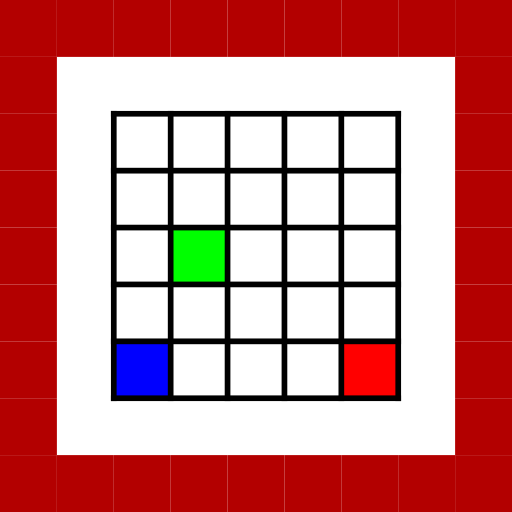
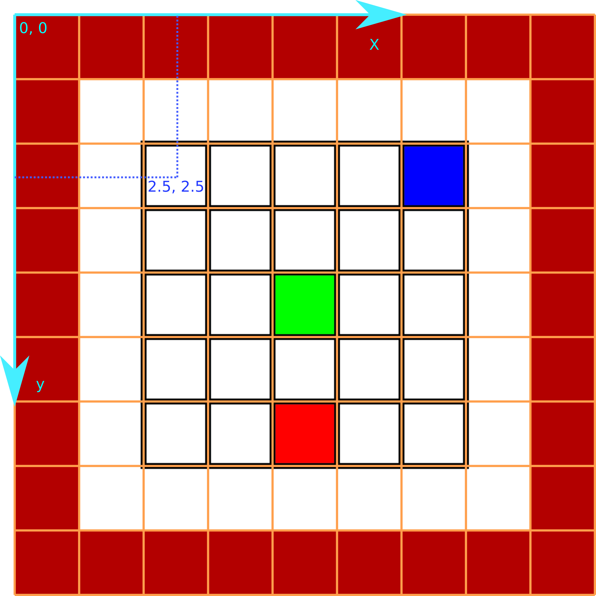

KrakRobot 2016
==============

Przedszkole robotów – instrukcja obsługi symulatora
-------------------


Niniejszy dokument stanowi instrukcję obsługi symulatora używanego w etapie online zawodów KrakRobot 2016. Aby zapoznać się z formalnymi regułami zadania, należy odnieść się do regulaminu zamieszczonego na stronie http://www.krakrobot.pl

Zadaniem drużyn jest samodzielne stworzenie programu, który będzie sterować robotem znajdującym kolorowe pola na planszy.

Nacisk w zadaniu położony jest na problemy związane z niedokładnością w poruszaniu się robotów. Programy zawodników muszą wykorzystywać strukturę planszy, aby upewniać się co do dokładnego położenia robota.

W razie jakichkolwiek pytań lub wątpliwości, prosimy o kontakt: http://www.krakrobot.pl/kontakt


Zasady używania symulatora
------------------------

1. Niniejsza wersja symulatora przeznaczona jest do wykorzystania przez zawodników do lokalnego testowania rozwiązań na własnych komputerach. Dla zarejestrowanych drużyn zostanie udostępniona w internecie automatyczna testerka służąca do nadsyłania rozwiązań i testowania ich online.
2. Złamanie zasad zawartych w tej instrukcji lub regulaminie zadania grozi dyskwalifikacją drużyny.
3. Organizatorzy zastrzegają sobie prawo do zmiany sposobu działania symulatora, z zastrzeżeniem że zmiany te nie mogą wpływać na poprawność rozwiązań


Podsumowanie zadania
--------------------

Uwaga: to podsumowanie jest niepełne. Prosimy o odniesienie się do formalnego regulaminu na stronie.

1. Robot znajduje się na kwadratowej planszy o białej powierzchni z czarnymi liniami formującymi kratę 5 x 5 pól, z których niektóre są kolorowe (czerwone, zielone lub niebieskie), a niektóre – białe
2. Robot może się poruszać po planszy, odczytywać kolor planszy czujnikiem koloru oraz wydawać z siebie pojedyncze piknięcia ("beeps")
3. Zadaniem robota jest wydanie pojedynczych piknięć kolejno na polach: czerwonym, zielonym i niebieskim, a następnie zakończenie przejazdu
4. Do wyniku (maks. 3 punkty) liczy się liczba poprawnie wydanych odgłosów, a następnie (w przypadku remisów) - jak najkrótszy czas **od pierwszego piknięcia** do zakończenia przejazdu


Instalacja
----------------

### Windows

W systemie Windows należy zainstalować Python 2.7 : http://www.python.org/getit/ . Należy upewnić się, że python.exe zostało dodane do zmiennej środowiskowej PATH.
Następnie należy zainstalować pakiety numpy, scipy oraz PyQt. Instalacja tych pakietów dla Windows może być wykonana przy użyciu kodów binarnych ze strony http://www.lfd.uci.edu/~gohlke/pythonlibs/. Można także użyć systemu zarządzania pakietami do Pythona, na przykład pip.

### Linux

W systemie Linux należy zainstalować Python 2.7 oraz pakiety PyQt i numpy oraz scipy. Można zainstalować numpy i scipy używając pip. Dla dystrybucji Ubuntu, pakiet Qt jest dostępny pod nazwą python-qt4, więc można po prostu wykonać w terminalu polecenie ``sudo apt-get install python-qt4``


Symulator
------------

### Podstawowe informacje

1. Symulator komunikuje się z botem przy pomocy standardowego wejścia i wyjścia
2. Do pisania programu można wykorzystać języki programowania: Python 2.7, Python 3, C++ oraz Java (te języki będą dopuszczone na automatycznej testerce)
3. W każdym z powyższych języków zawodnikom dostępna jest tylko standardowa biblioteka tego języka. Na automatycznej testerce nie będzie zainstalowanych dodatkowych bibliotek.
4. Programy nie mogą wykonywać wywołań systemowych (tworzyć i otwierać plików, używać gniazd TCP itp.) - złamanie tej zasady grozi dyskwalifikacją. W razie wątpliwości prosimy o kontakt.
5. Symulacja jest aktualizowana krokowo. W każdym kroku symulacji robot jest proszony o wybór swojej kolejnej akcji.

### Uruchamianie

Są dwa sposoby uruchomienia symulatora: w trybie graficznym lub w trybie konsolowym.
Tryb graficzny umożliwia zobaczenie przejazdu robota na wizualizacji, jak również odtwarzanie przejazdu lub jego fragmentów w ramach powtórki. Aby uruchomić symulator w trybie graficznym, należy wykonać polecenie

``python simulator/main.py``

Uruchamianie symulatora w trybie konsolowym:

``python simulator/main.py -c``

wiąże się z podaniem programowi opcji konfiguracyjnych (patrz niżej).

W obu trybach można kontrolować parametry symulacji.

### Opcje symulatora

Wszystkie opcje, które przyjmuje symulator, są zdefiniowane i opisane w pliku ``simulator/main.py`` - wszystkim początkującym użytkownikom polecamy używanie trybu graficznego symulatora, gdzie można zmieniać parametry symulacji.

### GUI

W trybie graficznym ważne są dwie opcje:

* ``frame_dt`` - jeden z parametrów symulatora (edycja możliwa u góry okna), wyznacza okres między klatkami animacji - im mniejsza wartość, tym dokładniej symulacja będzie wizualizowana (przydatne, jeżeli chce się zobaczyć szczegółowe działanie robota w pewnym krótkim czasie)
* ``Anim. rate`` - (widoczna obok paska przewijania) szybkość wyświetlania kolejnych klatek animacji. Warto zwiększyć, jeżeli wyświetlenie całej symulacji zajmuje zbyt dużo czasu.

### Implementacja symulatora

Parametry, które mogą się zmieniać między przejazdami, są podawane botowi na starcie symulacji.

Symulator wykonuje symulację dopóki któryś z następujących warunków nie zostanie spełniony:

* Osiągnięty został limit czasu symulacji
* Robot przekroczył limit czasu obliczeń
* Robot przekroczył limit pamięci RAM (odnosi się tylko do testerki online)
* Robot zakończył przejazd, wysyłając odpowiednią komendę
* W kodzie robota rzucony został wyjątek
* Robot uległ zniszczeniu na skutek kolizji ze ściankami otaczającymi planszę

Przed każdym krokiem symulacji, symulator podaje botowi dwie informacje:
* aktualny odczyt koloru w formacie RGB
* aktualny czas symulacji

W każdym kroku symulacji, wykonywane jest jedno polecenie (z odpowiednim zaaplikowanym do niego szumem, np. niedokładnością w poruszaniu się). W pojedynczym kroku, robot może

* Jechać do przodu lub do tyłu (odległość o którą przemieszcza się robot w jednym kroku jest zdefiniowana na liście stałych poniżej)
* Skręcać (odległość kątowa zdefiniowana poniżej)
* Zakomunikować zakończenie zadania

Mimo, że krata na planszy składa się z dyskretnych pól, pozycja robota jest zakodowana jako 64-bitowa liczba rzeczywista - nie jako liczba całkowita.

Jeżeli podczas ruchu robot miałby wyjechać poza granice planszy, ruch nie odbywa się (chociaż czas potrzebny na jego wykonanie jest zużywany). Obszar poza planszą ma kolor ciemnoczerwony (179, 0, 0) i taki kolor zostanie zarejestrowany przez czujnik koloru robota, gdy ten będzie wyjeżdżał za granicę planszy

**WAŻNE**: Odczyt koloru z planszy jest zaimplementowany przy pomocy pliku graficznego PNG, z którego pobierany jest kolor planszy. Ponieważ przy konwersji pliku SVG na PNG na granicach kolorów dochodzi do mieszania kolorów, kolor między linią a polem nie przechodzi od razu od czarnego (0, 0, 0) do białego (255, 255, 255) czy innych kolorów, ale robot może (choć nie musi) zarejestrować także wartości pośrednie.

### Jednostki miar

**WAŻNE!** : w oficjalnym regulaminie wymiary elementów planszy są podane w centymetrach, tak by zawodnicy łatwiej mogli sobie wyobrazić zależności między wielkościami tych elementów. Jednak z powodów implementacyjnych symulator używa innej jednostki, gdzie liczba 1.0 odpowiada szerokości jednego pola kraty - czyli 22 cm (szerokość białego obszaru pola to 20 cm, podczas gdy każda czarna linia ma 2 cm, jednak tylko połowa grubości każdej linii wlicza się do szerokości pola, co daje 20 + 2 * 1 = 22). Wszystkie odległości i wymiary podane w niniejszej instrukcji (poza tymi, gdzie wyraźnie jako jednostka zaznaczone są centymetry) oraz wartości podawane przez symulator, wyrażone są w opisanych powyżej jednostkach symulatora.

Jeżeli chodzi o kąty (używane przy obrotach), przyjętą jednostką są radiany (pełen obrót = 2&pi;), gdzie wartości dodatnie to obrót w lewo, a wartości ujemne to obrót w prawo.


### Plansza do gry

Obecnie w symulatorze dostępna jest pojedyncza przykładowa mapa do gry (przypominamy, że liczba i położenie pól kolorowych nie jest zdefiniowane w regulaminie i najprawdopodobniej będzie inne w ostatecznym ułożeniu planszy, używanym do oficjalnego testowania nadesłanych rozwiązań).



**WAŻNE!** : Zgodnie z regulaminem, krata na planszy ma 5x5 pól. Jednak w implementacji symulatora, plansza jest większa - ma 9x9 pól, czyli w sumie z każdej strony planszy są dodane dwa pola - jest to spowodowane faktem, że krata na planszy jest otoczona białym pustym obszarem, a dodatkowo w implementacji dochodzi jeszcze obszar, na którym sprawdzana jest kolizja - wyjeżdżanie poza planszę. Poniżej prezentujemy planszę z regulaminu z polami naniesionymi tak, jak wyglądają od strony implementacji symulatora oraz z osiami układu współrzędnych.



Warto zauważyć, że początek układu współrzędnych symulatora znajduje się w punkcie, który według regulaminu znajduje się poza planszą. Dlatego robot, w przypadku gdyby startował w lewym górnym narożniku kraty, miałby współrzędne początkowe (2.5, 2.5). Z kolei wymiary planszy (M x N) podawane na starcie symulacji botowi będą wynosiły 9 x 9.

### Generator map

W obecnej wersji dołączony jest prosty generator map (``simulator/generate_map.py``), który generuje plik SVG i PNG na podstawie pliku ``.map``.

UWAGA: to narzędzie jest obecnie w początkowym stadium rozwoju. Organizatorzy udostępniają je zawodnikom w celu ułatwienia pracy przy tworzeniu nowych plansz, jednak podczas działania mogą ujawnić się błędy lub ograniczenia.

Do konwersji pliku SVG na PNG narzędzie to wymaga zainstalowanego na komputerze programu Inkscape wraz z jego interfejsem konsolowym (CLI). W przypadku braku tego programu zostanie wygenerowany plik SVG, który następnie można ręcznie przekonwertować do pliku PNG innym programem. Domyślna wielkość pliku PNG przyjmowana przez symulator to 512x512 px.

Dostępne opcje programu to:
* ``--map_file`` - ścieżka do pliku typu ``.map`` (domyślnie: ``maps/1.map``)
* ``--svg_output_file`` - ścieżka do wyjściowego pliku SVG (przy braku opcji pobierana z pliku ``.map``)
* ``--png_output_file`` - ścieżka do wyjściowego pliku PNG (przy braku opcji pobierana z pliku ``.map``)

Obecnie mechanizm rozmieszczania kolorowych pól na planszy jest w sposób uproszczony realizowany przy pomocy tablicy ``beeps`` zawartej w pliku ``.map`` - pierwsze współrzędne w tablicy wyznaczają pozycję pola czerwonego, a dalej - zielonego i niebieskiego. Tym samym generator może tworzyć tylko plansze, na których znajduje się co najwyżej jedno pole z każdego koloru (przypominamy, że regulamin nie precyzuje górnego limitu pól z jednego koloru).
Jeżeli zawodnicy chcą przetestować działanie swojego bota na bardziej skomplikowanej mapie, sugerujemy stworzenie własnego generatora bądź ręczne edytowanie pliku SVG z mapą w dobrym programie do edycji grafiki wektorowej typu Inkscape.

Bot
---------

Aby umożliwić tworzenie rozwiązań w różnych językach programowania, w tegorocznej edycji bot do gry jest tworzony przez zawodników jako niezależny program i komunikuje się z symulatorem przez standardowe wejście i wyjście programu - a nie jest, jak to było w poprzednich edycjach, klasą napisaną w języku Python używaną bezpośrednio w symulatorze.

Struktura programu jest dowolna, dopóki bot poprawnie komunikuje się z symulatorem. Jednak aby ułatwić rozpoczęcie pracy nad rozwiązaniem, organizatorzy zapewniają szablony rozwiązań zawierające już obsługę komunikacji z symulatorem. UWAGA: organizatorzy nie gwarantują pełnej poprawności działania szablonów. Zawodnicy mogą oprzeć swoje rozwiązania na tych programach na własną odpowiedzialność.

### Podawanie ścieżki do programu

Kod źródłowy bota jest podawany symulatorowi przy pomocy opcji -r w konsoli, np. dla bota napisanego w Python 2.7:

``python2.7 simulator/main.py -r "python2.7 examples/python/template_bot.py"``

lub dla bota napisanego w c++:

``python2.7 simulator/main.py -r "./examples/cpp/run.sh"``

UWAGA: Powyższy przykład dla języka C++ zadziała tylko w systemach typu Unix/Linux lub w systemie Windows z zainstalowanym środowiskiem symulującym działanie Uniksowego terminala, jak na przykład Git Bash. Chcąc pracować wyłącznie w linii komend systemu Windows, zawodnicy muszą napisać swój własny skrypt do uruchamiania bota.

### Przekazywane parametry

Parametry symulacji są podawane botowi na początku programu przez standardowe wejście programu. Format danych to:

```
<nazwa parametru>
<wartość parametru>
```

na przykład

```
speed
0.2
```

Parametry podawane przez symulator to (obecnie wartości wszystkich podawanych parametrów są typu ``float``:

* ``x`` - pierwsza współrzędna pozycji startowej
* ``y`` - druga współrzędna pozycji startowej
* ``angle`` - orientacja startowa (od 0 do 2&pi; - kąt mierzony w radianach)
* ``steering_noise`` - wskaźnik (sigma szumu gaussowskiego) błędu aplikowanego do skręcania (im większy, tym bardziej faktyczna wielkość skrętu może się różnić od argumentu podanego do komendy ``TURN``)
* ``distance_noise`` - wskaźnik (sigma szumu gaussowskiego) błędu aplikowanego do jazdy (im większy, tym bardziej faktyczna odległość jazdy może się różnić od argumentu podanego do komendy ``MOVE``)
* ``forward_steering_drift`` - wartość błędu, który jest dodawany do _orientacji_ robota przy każdym kroku ``MOVE`` (symulacja błędu wynikającego z konstrukcji robota, który powoduje zbaczanie z drogi)
* ``speed`` - szybkość jazdy robota
* ``turning_speed`` - szybkość obrotu robota
* ``M`` - liczba pól planszy w symulatorze na osi x
* ``N`` - liczba pól planszy w symulatorze na osi y
* ``execution_cpu_time_limit`` - limit czasu obliczeń przeznaczonego dla bota na całą symulację

UWAGA: kolejność podawania argumentów na wejście bota nie jest zagwarantowana.

### Odczyt koloru i czas

Przed każdym krokiem symulator podaje aktualny odczyt koloru oraz czas symulacji, który upłynął od rozpoczęcia przejazdu, a dopiero potem żąda od bota wydania decyzji w sprawie następnej akcji robota.

Na przykład:

```
color
255 255 255
time
1.23
act
```

przekazuje botowi informację, że w tym kroku czujnik wykrywa kolor biały (255, 255, 255) oraz że od rozpoczęcia zadania upłynęło 1.23 sekundy. Następnie polecenie ``act`` prosi o nową komendę dla robota.

UWAGA: kolejność podawania informacji ``color`` i ``time`` nie jest zagwarantowana. Wiadomo jednak, że zostaną podane przed poleceniem ``act``.

### Wybór komendy

Polecenie ``act`` wysyłane przez symulator oznacza, że bot powinien podjąć decyzję co do następnej akcji robota. Dostępne są następujące komendy:

* ``MOVE <int>`` - liczba kroków jazdy do przodu (dodatnie argumenty) lub do tyłu (ujemne argumenty). UWAGA: w przypadku podania argumentu większego niż 1 lub mniejszego niż -1 (np. ``MOVE 43``) symulator najpierw wykona odpowiednią liczbę kroków symulacji potrzebną do zrealizowania polecenia, a dopiero potem zapyta bota o kolejną komendę
* ``TURN <int>`` - podobnie jak ``MOVE``, ale dotyczy liczby kroków dla obracania się robota
* ``BEEP`` - robot ma wydać pojedyncze piknięcie. Akcja ta jest niezbędna do zdobywania punktów w tegorocznym zadaniu.
* ``FINISH`` - zakończenie przejazdu. Po tej akcji zadanie się kończy i punkty mogą być podliczone.

UWAGA: dla poleceń ``MOVE`` i ``TURN`` argumentem jest liczba całkowita wyrażająca **liczbę kroków** symulacji, przez które robot ma wykonywać daną czynność - nie jest to odległość do przejechania. Aby obliczyć ile kroków jest potrzebnych do przejechania danej odległości, należy odnieść się do obliczeń na końcu tej instrukcji.

Krok symulacji nie wyznacza czasu, który zostanie pochłonięty przez daną akcję, gdyż jazda i obrót zajmują różne ilości czasu. Stosowne obliczenia dotyczące długości poszczególnych akcji znajdują się na końcu tej instrukcji.

Ograniczenia/wartości parametrów
----------------------------

Wartości parametrów błędu mogą się różnić w poszczególnych przejazdach. Te wartości będą się zawierać w poniższych przedziałach:

* ``steering_noise`` : [0, 4e-05]
* ``distance_noise`` : [0, 6e-04]
* ``forward_steering_drift``: [-4e-04, 4e-04]


Pozostałe parametry podawane robotowi są w tegorocznej konkurencji ustalone i mają podane poniżej wartości:

Początkowe ustawienie robota (zgodnie z regulaminem konkurencji):
* ``x = 2.5``
* ``y = 2.5``
* ``angle = 0.0``

Szybkość robota:

* ``speed = 0.2``
* ``turning_speed = 1.0``

Limit czasu obliczeń:

* `` execution_cpu_time_limit = 100.0``

Punktacja
--------------------

Obecna wersja symulatora jest przeznaczona do testowania lokalnego. Zawodnicy mogą podliczać punkty po przejeździe robota zgodnie z regulaminem. Liczenie punktów będzie zrealizowane automatycznie na testerce online, która zostanie uruchomiona nie później niż trzy tygodnie przed terminem nadsyłania rozwiązań wyznaczonym w regulaminie zawodów.

W momencie ostatecznego podliczania punktów, programy wszystkich drużyn zostaną uruchomione na takich samych zestawach parametrów i na takiej samej planszy.

Bot każdej z drużyn zostanie uruchomiony __jednokrotnie__ i na podstawie tego przejazdu wyliczana będzie liczba punktów.

Wskazówki
-------------

Wskazówki programistyczne i rady dotyczące najważniejszych problemów konkurencji będą dostępne dla zarejestrowanych drużyn.


Niezbędne stałe i wyliczenia
--------------------

Aby obliczyć, przez ile kroków symulacji należy jechać lub skręcać, by przebyć żądaną odległość/kąt, należy skorzystać z poniższych stałych:

* odległość (w jednostkach symulatora), którą robot przebywa w ciągu jednego kroku:
``TICK_MOVE = 0.01``
* kąt (w radianach), o który robot obraca się w ciągu jednego kroku:
``TICK_ROTATE = 0.002``

Czyli na przykład, aby przejechać szerokość jednego pola planszy, potrzeba ``1.0 / TICK_MOVE`` kroków. Przypominamy, że liczba ta musi być zaokrąglona do liczby całkowitej, aby została przyjęta przez symulator.

Aby obliczyć czas wykonania akcji dla ``n`` kroków symulacji:

* ``MOVE n``: ``time = n * TICK_MOVE / speed``
* ``TURN n``: ``time = n * TICK_ROTATE / turning_speed``

Czujnik koloru oddalony jest od środka robota o 11 cm, czyli:
``COLOR_SENSOR_DISTANCE = 0.5``
