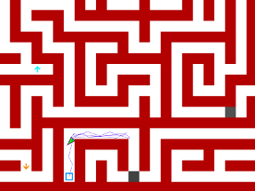
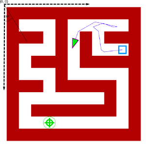

Krakrobot 2014 Lost in the Cracows' alleys
===========================

Welcome to the rules and technical specification for the Krakrobot 2014 online qualifications problem.

The qualification round consists of one task,
called “Lost in the Cracows' alleys”. Your task will be to write the robot's AI allowing
it to figure out the way through complex maze of alleys as quick as possible.

In this package you will find the simulator, exemplary maps in maps directory and exemplary robots in the examples directory.

General rules
-----------------------

1. Contestants have to be students, enrolled at Bachelor, Masters or PhD level programme in any field.
2. KrakRobot is a team competition – each team has to consist of 2 or 3 people, working together.
3. Task is simulation based – the appropriate code bundled
 with exemplary maps and robots is available https://github.com/uj-robotics/Krakrobot2014Qualifications
4. Each team write their own implementation of the robot's AI (one per team), some sample implementations are also avaliable in
the package
5. Robot moves around a rectangular map of dimensions M x N (unknown to the robot)
6. Robot is executed by simulator. Robot can choose from given set of actions (for instance move, or turn)
7. Each action performed (both sensing and acting) costs some time. The robot's total simulation time is the summarized cost of all performed actions
 from the simulation start to the moment of reaching the goal state
 (which is checked automatically by the simulation engine,
 and is defined as being located over the field and communicating it).
 The goal is to minimize total simulation time to finding the goal.
8. Each map can have upper bound on simulation time, after which all robots will be considered as having infinite total simulation time.
9. One round of simulations consists of running al contestants AI's on one, randomly generated map (the same for each robot).
In each round the constants (for instance accuracy of the GPS sensor) can change.
After each round, the ranking, obtained by sorting the total times in descending order, is created.
10. Whole qualification will consist of multiple rounds, and the final position of each robot will be its median position in all the rankings.
The best teams (number of advancing teams will be disclosed in January) will advance to the finals, which will take place at 12 april 2014 at Cracow.
11. Each simulation has limited CPU time, which will be passed to Robot at the initialization step. Besides that we set 1024 MB RAM limit.
12. Any modifications to the simulation code, attempts to hack the engine in order to achieve better score (either by reading the map or by any other type of cheating) will result in the disqualification.of noise applied to forward motion
13. Jury has indisputable right to disqualify any team if violations of this regulations are detected.
14. Jury has right to change the rules of this qualifications task at any time, however each modification will be sent to all
registered contestants and annouced on the official page www.krakrobot.pl. Also jury has right to provide minor modifications
to the simulator, however all changes will not affect solutions correctness and will be mailed to all registered contestants as well.
15. Final submission date is 12 Feb 2014, 24:00 GMT. Submissions will open around mid January (the date will be emailed and announced on the contest page).

Installation
---------------------
### Windows
For windows get python 2.7 for Windows : http://www.python.org/getit/ . Make sure you append python.exe to your PATH.
Now install packages numpy and PyQt. Installing packages for windows can be easily done using binaries from here : http://www.lfd.uci.edu/~gohlke/pythonlibs/ . You can also use python packaging system, for instance pip.

### Linux
For linux get python 2.7 and install packages PyQt and numpy. All of those packages should be bundled into packages for your linux. If not, install Qt4 and install pip (https://pypi.python.org/pypi/pip) and then simply type 

``pip install numpy; pip install pyqt4``

Map
---------------------
Map is a discretized grid with several field types, i.e:

* Empty field (field_type = 0)
* Wall (field_type = 1)
* Goal (field_type = 4)
* Start position (field_type = 3)
* Hint direction (field_type = 11, field_value in 0...7 indicating in sequence direction S, SE, E, NE, N, NW, N, SW)
* Hint optimal path direction (field_type = 10, field_value in 0....7 indicating in sequence directions as above, however
note that the only possible values are S(0), E(2), N(4), W(6) )
* Hint distance (field_type = 9, field_value is a floor of actual distance to the goal)

We have bundled with the simulator map generator utility. To use it please refer to map_gen.py file  Generation of the maps can be highly parametrized, please refer
to the documentation in the code. Note however that maps for the final evaluation might be generated differently (that is using different generator, or designed by hand).

Simulator
---------------------------------
To complete this task it is vital to understand how the simulator works.
Please feel free to understand the code on your own, it was written to be very readable and self
explanatory. We will be also happy to answer all questions.

### Running

There are two ways to run KrakrobotSimulator. As a command tool, or in a windowed mode.
Using GUI you can replay and run simulations of your robot. To run GUI simply type

``python main.py``

To run command tool see running options for details.

 ``python main.py -h``

Both in command and windowed mode you can control parameters such as
precision of the GPS, or turning speed.

### Simulator implementation

Simulator runs the robot until one of the following criteria is met:

*  Simulation time has exceeded provided maximum
*  Robot has exceeded CPU time limit
*  Robot has exceeded RAM limit (note: not controlled in your version)
*  Robot has reached the goal
*  Robot has thrown an exception
*  Robot has exceeded maximum number of collisions (dependent on the map, but always more than 100)

Every step of the simulation is an execution of one command (with appropriate
noise if applicable. Noise applicable to *every tick*). In one step robot can

* Move by tick (one tick distance is specified in defines.py in TICK_MOVE constant)
* Turn by tick (one tick angular distance is specified in defines.py in TICK_ROTATE constant)
* Use one of the three provided sensors
* Communicate finishing

Please note that we can adjust slightly the TICK_MOVE and TICK_ROTATE constants, so
do not rely on them having specific value.

If by moving Robot collides with wall it doesn't move (but time for movement is consumed).
Robot can issue commands with multiple ticks, for instance [MOVE, 10], but such a move will be
discretized into 10 separate 1-tick moves.

On the start of the simulation Simulator calls **init** on provided RobotController instance and
provides RobotController with constants for this run (i.e. moving speed, turning speed, gps measurement speed,
noise of move, noise of turn, noise of GPS, noise of sonar, CPU execution time limit
).

All constants lie within bounds specified in the Constants Bounds section.

Map is implemented as a discrete grid (of unknown to robot size), however move is executed continously
(i.e. robot's position is stored as 64 bit precision numbers, not integers).

### Sensors

Robot is equipped with three sensors: GPS, sonar and field sensor.

When GPS is used RobotController on_sense_gps is called with measured absolute
x and y coordinates. 

When sonar is used Simulator calculates distance to the closest wall along ray casted
from the Robot center in the heading direction.

Field sensor might be a little bit confusing. When called Simulator calculates on which
field the Robot is right now (i.e. floor(x), floor(y) ) and calls on_sense_field with 
field type and field value as arguments (for instance distance). Note that when Robot 
is close to the boundary of a field the results might be hard to predict. 

RobotController
---------------------------------

You task is to implement RobotController interface. The code should
be written in Python 2.7. For now we allow following packages: numpy, scipy and scikit-learn. Please
send us and email if you want to use another packages and we will consider it individually.
Note that your code cannot use system calls (for instance open file, communicate by TCP, etc.). Every
violation of this rule might result in disquallification, or penalty score. Please email us with any
questions.

To see RobotController class and exemplary implementations please see *robot_controller.py* file.

The RobotController class should implement

* **init(starting_position, steering_noise, distance_noise, sonar_noise, gps_noise, speed, turning_speed, gps_delay,
execution_cpu_time_limit) - initialization function. Specifications of the arguments:
	* starting_position : tuple [x,y,angle], where x and y are accurate positions of the robot (we assume
upper-left corner is (0,0) and x runs vertically, whereas y runs horizontally) and angle which is an angle in radians
with respect to X axis 
	* steering_noise : sigma of gaussian noise applied to turning motion
	* distance_noise : sigma of gaussian noise applied to forward motion
	* sonar_noise : sigma of gaussian noise applied to sonar
	* gps_noise : sigma of gaussian noise applied to gps measurements
	* speed : speed in units/simulation_second of the robot (speed of the forward motion)
	* turning_speed: turning speed in radians/simulation_second of the robot
	* gps_delay : amount of simulation time units to run gps measurement
	* execution_cpu_time_limit: total real running time that can be consumed by the robot in seconds

* **act()** - this is the basic function. It is called always after executing last command.
In act you should return a list. For constants see *defines.py*

	*  Moving : ["move", number_of_ticks] - consumes variable amount of time: number_of_ticks*TICK_MOVE / speed
	*  Turning : ["turn", number_of_ticks] - consumes variable amount of time: number_of_ticks*TICK_TURN / speed
	*  Sense GPS: ["sense_gps"] - consumes variable amount of time: gps_delay
	*  Sense sonar: ["sense_sonar"] - consumes constant amount of time : 0.01 simulation time unit
	*  Sense field: ["sense_field"] - consumes constant amount of time : 0.01 simulation time_unit
	*  Communicate finish: ["finish"] - consumes 0 units of time

* **on_sense_gps(x,y)** - reponds to (x,y) measurement (no return)

* **on_sense_sonar(distance)** - responds to (distance) measurement (no return)

* **on_sense_field(field_type, field_value)** - responds to (field_type, field_value) measurement (no return)

Constants bounds
--------------------
Every pass might differ in the constants. In one pass you can heavily rely on GPS, however in the other one
you might be on your own with sonar. Here are limits, within each constant will lie in:

* steering_noise : [0, 1.0]
* sonar_noise : [0, 1.0]
* gps_noise : [0, 50.0]
* distance_noise : [0, 1.0]
* simulation_time_limit : arbitrary
* speed : [0, 10]
* turning_speed : [0, 10]
* gps_delay : [0, 10.0]

Evaluation
----------------------
Current version is local, that is you are not submitting your code to us. We will launch online evaluation
in the mid January. The online evaluation opening date will be emailed to contestants and announced on the
contest page. The final evaluation will take place some time after 12.02.2014 and results will be announced on the contest page.

Hints and resources
-------------------------
We strongly encourage you to get familiar with the
resources that we link in here, as they are tremendously helpful in solving this task.

We are aware that you might be not familliar with python, however we believe that this
is a great tool for robotics and it is worth learning.

To learn python we recommend this tutorial : www.learnpython.org/

We also recommend taking this course : https://www.udacity.com/course/cs373 , this is a fairly simple and short
course that will provide you with many techniques that will be essential for successful competition.

